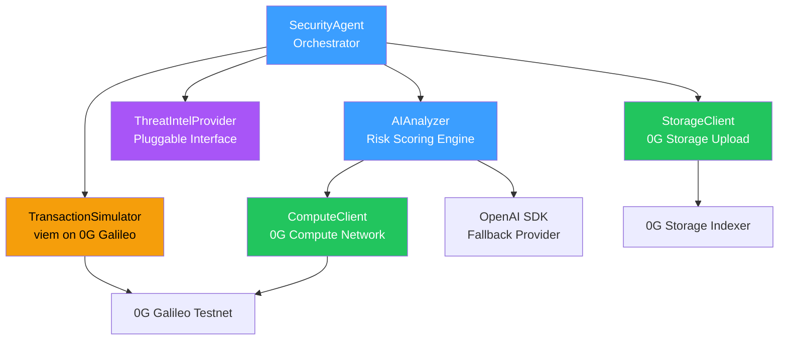
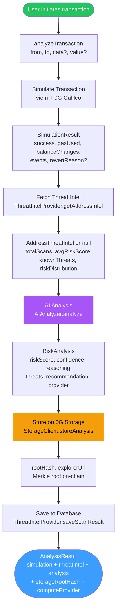

<div align="center">

# 🛡️ SIFIX Agent

**AI-Powered Transaction Security SDK for Web3**

[](https://www.npmjs.com/package/@sifix/agent)
[](./LICENSE)
[](https://www.typescriptlang.org/)
[](https://zero.network/)
[](https://chainscan-galileo.0g.ai/)

</div>

---

SIFIX Agent is an open-source SDK that provides **real-time AI transaction security analysis** for Web3 wallets and dApps. It simulates transactions on-chain, runs risk analysis via decentralized or centralized AI, stores cryptographic evidence on 0G Storage, and returns actionable recommendations — all before the user signs.

Built on the **full 0G stack**: [0G Chain](https://0g.ai), [0G Compute](https://zero.network/) for decentralized AI inference, [0G Storage](https://zero.network/) for tamper-proof evidence storage, and 0G Agentic ID for on-chain identity.

## Latest Progress (May 2026)

- Added **real transaction simulation hardening** with better gas/state diff coverage and transfer parsing.
- Added **rule-engine merge pipeline** so deterministic rules can raise final risk beyond AI-only output.
- Added **signature-guard hardening** for `permit` / typed-data flows, including 4byte lookup cache and contract registry checks.
- Standardized on **0G Galileo Testnet (Chain ID 16602)** across SIFIX stack.
- Maintains compatibility with dApp safe-report policy and prediction-accuracy tracking pipeline.

## ✨ Features

- 🔍 **Transaction Simulation** — Simulate transactions on 0G Galileo Testnet using viem before execution
- 🤖 **AI Risk Analysis** — Multi-provider AI risk assessment with structured scoring and reasoning
- ⚡ **0G Compute** — Decentralized AI inference via the 0G Compute Network broker
- 📦 **0G Storage** — Permanent, verifiable evidence storage with Merkle root hashes
- 🧠 **Threat Intelligence** — Pluggable interface for historical scan data and address reputation
- 🔌 **6+ AI Providers** — OpenAI, Groq, OpenRouter, Ollama, Together AI, or any OpenAI-compatible API
- 🎯 **5-Tier Risk Scoring** — SAFE → LOW → MEDIUM → HIGH → CRITICAL with BLOCK/WARN/ALLOW recommendations
- 🧪 **Mock Mode** — Deterministic keccak256 hashing for development without network dependency
- 🔐 **Agent Identity** — Optional ERC-7857 Agentic ID provenance embedded in scan evidence
- 📜 **TypeScript-First** — Full type safety with Zod-compatible interfaces

---

## 📑 Table of Contents

- [Installation](#-installation)
- [Quick Start](#-quick-start)
- [Usage Examples](#-usage-examples)
  - [Full 0G Stack (Compute + Storage)](#1-full-0g-stack-compute--storage)
  - [Compute Only (No Storage)](#2-compute-only-no-storage)
  - [OpenAI Fallback](#3-openai-fallback)
  - [Groq (Fast & Free)](#4-groq-fast--free)
  - [OpenRouter (Multi-Model)](#5-openrouter-multi-model)
  - [Ollama (Local / Self-Hosted)](#6-ollama-local--self-hosted)
  - [Together AI](#7-together-ai)
  - [With Threat Intelligence](#8-with-threat-intelligence)
  - [With Agent Identity](#9-with-agent-identity)
  - [Legacy API (Deprecated)](#10-legacy-api-deprecated)
- [Architecture](#-architecture)
- [Analysis Flow](#-analysis-flow)
- [API Reference](#-api-reference)
  - [SecurityAgent](#securityagent)
  - [AIAnalyzer](#aianalyzer)
  - [TransactionSimulator](#transactionsimulator)
  - [StorageClient](#storageclient)
  - [ComputeClient](#computeclient)
  - [ThreatIntelProvider](#threatintelprovider)
- [Configuration](#-configuration)
  - [AgentConfig](#agentconfig)
  - [AIConfig](#aiconfig)
  - [StorageConfig](#storageconfig)
  - [ComputeConfig](#computeconfig)
- [Risk Levels](#-risk-levels)
- [Supported AI Providers](#-supported-ai-providers)
- [Mock Mode](#-mock-mode)
- [0G Network Reference](#-0g-network-reference)
- [Environment Variables](#-environment-variables)
- [Development](#-development)
- [License](#-license)

---

## 📦 Installation

```bash
npm install @sifix/agent
```

**Using pnpm:**
```bash
pnpm add @sifix/agent
```

**Using yarn:**
```bash
yarn add @sifix/agent
```

### Peer Requirements

- Node.js ≥ 18
- TypeScript ≥ 5.0 (recommended)

The package bundles these dependencies automatically:
`@0gfoundation/0g-storage-ts-sdk`, `@0gfoundation/0g-compute-ts-sdk`, `openai`, `ethers`, `viem`, `zod`

---

## 🚀 Quick Start

```typescript
import { SecurityAgent } from '@sifix/agent';

const agent = new SecurityAgent({
  rpcUrl: 'https://evmrpc-testnet.0g.ai',
  compute: {
    privateKey: process.env.ZEROG_PRIVATE_KEY!,
    providerAddress: process.env.ZEROG_COMPUTE_PROVIDER!,
  },
  storage: {
    indexerUrl: 'https://indexer-storage-testnet-turbo.0g.ai',
    privateKey: process.env.ZEROG_PRIVATE_KEY,
  },
});

// Initialize 0G Compute broker (acknowledge provider, fetch metadata)
await agent.init();

// Analyze a transaction before the user signs it
const result = await agent.analyzeTransaction({
  from: '0x742d35Cc6634C0532925a3b844Bc9e7595f0bEb',
  to: '0x1234567890123456789012345678901234567890',
  data: '0xa9059cbb000000000000000000000000...',
  value: 0n,
});

console.log(result.analysis.riskScore);       // 75
console.log(result.analysis.recommendation);   // 'BLOCK'
console.log(result.analysis.provider);          // '0g-compute'
console.log(result.storageRootHash);            // '0xabc123...'
console.log(result.storageExplorer);            // 'https://chainscan-galileo.0g.ai/tx/...'
```

---

## 📖 Usage Examples

### 1. Full 0G Stack (Compute + Storage)

Fully decentralized: AI inference through 0G Compute, evidence stored on 0G Storage.

```typescript
import { SecurityAgent } from '@sifix/agent';

const agent = new SecurityAgent({
  rpcUrl: 'https://evmrpc-testnet.0g.ai',
  compute: {
    privateKey: process.env.ZEROG_PRIVATE_KEY!,
    providerAddress: process.env.ZEROG_COMPUTE_PROVIDER!,
  },
  storage: {
    indexerUrl: 'https://indexer-storage-testnet-turbo.0g.ai',
    privateKey: process.env.ZEROG_PRIVATE_KEY,
    mockMode: false,
  },
});

await agent.init();
const result = await agent.analyzeTransaction({
  from: '0x...',
  to: '0x...',
  data: '0x...',
  value: 0n,
});
```

### 2. Compute Only (No Storage)

Use decentralized AI inference without storing evidence on-chain.

```typescript
const agent = new SecurityAgent({
  rpcUrl: 'https://evmrpc-testnet.0g.ai',
  compute: {
    privateKey: process.env.ZEROG_PRIVATE_KEY!,
    providerAddress: process.env.ZEROG_COMPUTE_PROVIDER!,
  },
});

await agent.init();
const result = await agent.analyzeTransaction({
  from: '0x...',
  to: '0x...',
  value: 0n,
});
```

### 3. OpenAI Fallback

Use OpenAI directly when 0G Compute is unavailable.

```typescript
const agent = new SecurityAgent({
  rpcUrl: 'https://evmrpc-testnet.0g.ai',
  aiProvider: {
    apiKey: process.env.OPENAI_API_KEY!,
    model: 'gpt-4-turbo-preview',
  },
});
```

### 4. Groq (Fast & Free)

Ultra-fast inference via Groq's LPU infrastructure.

```typescript
const agent = new SecurityAgent({
  rpcUrl: 'https://evmrpc-testnet.0g.ai',
  aiProvider: {
    apiKey: process.env.GROQ_API_KEY!,
    baseURL: 'https://api.groq.com/openai/v1',
    model: 'llama-3.1-70b-versatile',
  },
});
```

### 5. OpenRouter (Multi-Model)

Access hundreds of models through OpenRouter's unified API.

```typescript
const agent = new SecurityAgent({
  rpcUrl: 'https://evmrpc-testnet.0g.ai',
  aiProvider: {
    apiKey: process.env.OPENROUTER_API_KEY!,
    baseURL: 'https://openrouter.ai/api/v1',
    model: 'anthropic/claude-3.5-sonnet',
  },
});
```

### 6. Ollama (Local / Self-Hosted)

Run AI analysis locally with Ollama — no API keys needed.

```typescript
const agent = new SecurityAgent({
  rpcUrl: 'https://evmrpc-testnet.0g.ai',
  aiProvider: {
    apiKey: 'ollama',                    // dummy key required by OpenAI SDK
    baseURL: 'http://localhost:11434/v1',
    model: 'llama3.1:70b',
  },
});
```

### 7. Together AI

High-performance open-source models via Together AI.

```typescript
const agent = new SecurityAgent({
  rpcUrl: 'https://evmrpc-testnet.0g.ai',
  aiProvider: {
    apiKey: process.env.TOGETHER_API_KEY!,
    baseURL: 'https://api.together.xyz/v1',
    model: 'meta-llama/Meta-Llama-3.1-70B-Instruct-Turbo',
  },
});
```

### 8. With Threat Intelligence

Provide historical scan data for smarter analysis. Implement the `ThreatIntelProvider` interface with your database (e.g., Prisma, Drizzle, MongoDB).

```typescript
import { SecurityAgent, ThreatIntelProvider, AddressThreatIntel } from '@sifix/agent';

// Implement the interface with your own database
class PrismaThreatIntel implements ThreatIntelProvider {
  async getAddressIntel(address: `0x${string}`): Promise<AddressThreatIntel | null> {
    // Query your DB for aggregated scan history
    const scans = await db.scan.findMany({ where: { address } });
    if (scans.length === 0) return null;
    return aggregateIntel(scans);
  }

  async saveScanResult(result): Promise<void> {
    // Persist scan result for future lookups
    await db.scan.create({ data: result });
  }
}

const agent = new SecurityAgent({
  rpcUrl: 'https://evmrpc-testnet.0g.ai',
  compute: {
    privateKey: process.env.ZEROG_PRIVATE_KEY!,
    providerAddress: process.env.ZEROG_COMPUTE_PROVIDER!,
  },
  threatIntel: new PrismaThreatIntel(),
});

await agent.init();
// Each analysis now factors in historical patterns for the target address
const result = await agent.analyzeTransaction({ from, to });
```

### 9. With Agent Identity

Embed on-chain agent identity metadata (ERC-7857 Agentic ID) into stored evidence for provenance tracking.

```typescript
const agent = new SecurityAgent({
  rpcUrl: 'https://evmrpc-testnet.0g.ai',
  compute: { ... },
  storage: { ... },
  agentIdentity: {
    tokenId: '42',
    contractAddress: '0xAgenticNFTContract...',
    network: '0g-galileo-testnet',
    model: 'llama-3.1-70b',
  },
});
```

### 10. Legacy API (Deprecated)

The original simplified configuration is still supported but deprecated.

```typescript
const agent = new SecurityAgent({
  rpcUrl: 'https://evmrpc-testnet.0g.ai',
  openaiApiKey: process.env.OPENAI_API_KEY,
});
```

> ⚠️ Prefer `aiProvider` or `compute` for new integrations.

---

## 🏗️ Architecture



<details>
<summary>📐 ASCII Version</summary>

```
┌─────────────────────────────────────────────────────────────────┐
│                        SIFIX Agent SDK                          │
│                                                                 │
│  ┌──────────────┐                                               │
│  │ SecurityAgent│  ◄── Orchestrator: coordinates the full flow  │
│  │  (index.ts)  │                                               │
│  └──────┬───────┘                                               │
│         │                                                       │
│         ├──────► ┌──────────────────────┐                       │
│         │        │ TransactionSimulator │  viem on 0G Galileo   │
│         │        │   (core/simulator)   │  simulate + gas est.  │
│         │        └──────────────────────┘                       │
│         │                                                       │
│         ├──────► ┌──────────────────────┐                       │
│         │        │  ThreatIntelProvider │  Interface (you impl) │
│         │        │ (threat-intel/)      │  DB-agnostic history  │
│         │        └──────────────────────┘                       │
│         │                                                       │
│         ├──────► ┌──────────────────────┐                       │
│         │        │     AIAnalyzer       │  Risk scoring engine  │
│         │        │    (ai/analyzer)     │                       │
│         │        └─────────┬────────────┘                       │
│         │                  │                                    │
│         │         ┌────────┴─────────────┐                      │
│         │         │                      │                      │
│         │    ┌────▼─────┐         ┌──────▼──────┐               │
│         │    │ Compute  │         │  OpenAI SDK │               │
│         │    │ Client   │         │ (fallback)  │               │
│         │    │(0G Net)  │         │             │               │
│         │    └──────────┘         └─────────────┘               │
│         │                                                       │
│         └──────► ┌──────────────────────┐                       │
│                  │   StorageClient      │  0G Storage upload    │
│                  │  (storage/client)    │  Merkle hash + retry  │
│                  └──────────────────────┘                       │
│                                                                 │
└─────────────────────────────────────────────────────────────────┘

External Dependencies:
  • 0G Galileo Testnet (Chain ID: 16602)
  • 0G Compute Network (decentralized AI brokers)
  • 0G Storage Indexer (Merkle tree upload/download)
  • OpenAI-Compatible APIs (optional fallback)
```
</details>

### Source Structure

```
src/
├── index.ts                     # SecurityAgent class (orchestrator)
├── ai/
│   └── analyzer.ts              # AIAnalyzer — dual provider routing
├── compute/
│   └── client.ts                # ComputeClient — 0G Compute broker wrapper
├── core/
│   └── simulator.ts             # TransactionSimulator — viem-based TX simulation
├── storage/
│   ├── client.ts                # StorageClient — 0G Storage upload/download
│   └── client.spec.ts           # Unit tests for mock mode
└── threat-intel/
    └── provider.ts              # ThreatIntelProvider interface
```

---

## 🔄 Analysis Flow



<details>
<summary>📐 ASCII Version</summary>

```
User initiates transaction
        │
        ▼
┌───────────────────┐
│  analyzeTransaction│
│  ({ from, to,     │
│   data?, value? }) │
└────────┬──────────┘
         │
         ▼
  ┌──────────────┐     viem + 0G Galileo Testnet
  │   Simulate    │────► SimulationResult
  │  Transaction  │      (success, gasUsed, balanceChanges,
  └──────┬───────┘      events, revertReason?)
         │
         ▼
  ┌──────────────┐     ThreatIntelProvider.getAddressIntel()
  │  Fetch Threat │────► AddressThreatIntel | null
  │  Intel        │      (totalScans, avgRiskScore, knownThreats,
  └──────┬───────┘      riskDistribution, recentScans[])
         │
         ▼
  ┌──────────────┐     AIAnalyzer.analyze()
  │  AI Analysis  │────► RiskAnalysis
  │               │      (riskScore, confidence, reasoning,
  └──────┬───────┘      threats[], recommendation, provider)
         │
         ▼
  ┌──────────────┐     StorageClient.storeAnalysis()
  │  Store on     │────► { rootHash, explorerUrl }
  │  0G Storage   │      (Merkle root hash on-chain)
  └──────┬───────┘
         │
         ▼
  ┌──────────────┐     ThreatIntelProvider.saveScanResult()
  │  Save to DB   │────► void (indexed for future scans)
  └──────┬───────┘
         │
         ▼
  AnalysisResult
  ├── simulation
  ├── threatIntel
  ├── analysis (riskScore, recommendation, ...)
  ├── timestamp
  ├── storageRootHash
  ├── storageExplorer
  └── computeProvider ('0g-compute' | 'openai')
```
</details>

---

## 📘 API Reference

### SecurityAgent

The main orchestrator class. Coordinates simulation, threat intelligence, AI analysis, and storage.

**Constructor**

```typescript
new SecurityAgent(config: AgentConfig)
```

**Methods**

- `init(): Promise<void>` — Initialize the 0G Compute broker. Must be called before the first analysis when using compute. Safe to call multiple times (idempotent).
- `analyzeTransaction(params: { from: Address, to: Address, data?: Hash, value?: bigint }): Promise<AnalysisResult>` — Run the full security analysis pipeline on a transaction.

**AnalysisResult**

```typescript
interface AnalysisResult {
  simulation: SimulationResult;           // Transaction simulation data
  threatIntel: AddressThreatIntel | null; // Historical threat data (if available)
  analysis: RiskAnalysis;                 // AI risk assessment
  timestamp: string;                      // ISO 8601 timestamp
  storageRootHash?: string;               // 0G Storage Merkle root hash
  storageExplorer?: string;               // 0G Chain explorer URL
  computeProvider?: 'openai' | '0g-compute'; // Which AI provider was used
}
```

---

### AIAnalyzer

Dual-mode AI risk analysis engine. Routes through 0G Compute (decentralized) or any OpenAI-compatible API.

**Constructor**

```typescript
new AIAnalyzer(config: AIConfig, computeClient?: ComputeClient)
```

If a `ComputeClient` is provided, it uses 0G Compute. Otherwise, it falls back to the OpenAI-compatible provider specified in `AIConfig`.

**Methods**

- `analyze(params: { from: Address, to: Address, simulation: SimulationResult, threatIntel: AddressThreatIntel | null }): Promise<RiskAnalysis>` — Analyze transaction risk using AI.

**RiskAnalysis**

```typescript
interface RiskAnalysis {
  riskScore: number;                         // 0-100
  confidence: number;                        // 0-1
  reasoning: string;                         // Human-readable explanation
  threats: string[];                         // List of identified threats
  recommendation: 'BLOCK' | 'WARN' | 'ALLOW'; // Action recommendation
  provider: 'openai' | '0g-compute';         // Which provider was used
}
```

**Recommendation Thresholds**

- `BLOCK` — riskScore ≥ 70
- `WARN` — riskScore ≥ 40
- `ALLOW` — riskScore < 40

---

### TransactionSimulator

Simulates transactions on 0G Galileo Testnet using viem. Detects balance changes, events, and revert reasons.

**Constructor**

```typescript
new TransactionSimulator(rpcUrl?: string)
// Default: 'https://evmrpc-testnet.0g.ai'
```

**Methods**

- `simulate(params: { from: Address, to: Address, data?: Hash, value?: bigint }): Promise<SimulationResult>` — Execute a simulated call against the current chain state.
- `estimateGas(params: { from: Address, to: Address, data?: Hash, value?: bigint }): Promise<bigint>` — Estimate gas cost for a transaction.

**SimulationResult**

```typescript
interface SimulationResult {
  success: boolean;
  gasUsed: bigint;
  balanceChanges: {
    token: Address;
    from: Address;
    to: Address;
    amount: bigint;
  }[];
  events: {
    name: string;
    args: Record<string, any>;
  }[];
  revertReason?: string;
}
```

---

### StorageClient

Uploads and retrieves analysis results from 0G Storage with Merkle tree verification and retry logic.

**Constructor**

```typescript
new StorageClient(config: StorageConfig & { mockMode?: boolean })
```

**Methods**

- `storeAnalysis(analysis: TransactionAnalysisData): Promise<{ rootHash: string; explorerUrl?: string }>` — Upload analysis JSON to 0G Storage. Returns the Merkle root hash and optional explorer URL. Retries up to 3 times with exponential backoff (2s, 4s).
- `retrieveAnalysis(rootHash: string): Promise<TransactionAnalysisData | null>` — Download analysis data from 0G Storage by root hash.
- `checkBalance(): Promise<bigint>` — Check the configured wallet's native token balance.

**TransactionAnalysisData**

```typescript
interface TransactionAnalysisData {
  from: string;
  to: string;
  value?: string;
  data?: string;
  riskScore: number;
  riskLevel: string;
  recommendation: string;
  reasoning: string;
  threats: string[];
  confidence: number;
  timestamp: string;
  simulationSuccess: boolean;
  gasUsed?: string;
}
```

---

### ComputeClient

Wraps the 0G Compute TS SDK broker for decentralized AI inference with OpenAI-compatible `/chat/completions` endpoints.

**Constructor**

```typescript
new ComputeClient(config: ComputeConfig)
```

**Methods**

- `init(): Promise<void>` — Create the broker, acknowledge the provider signer, and fetch service metadata (endpoint + model name). Must be called before `chatCompletion`.
- `chatCompletion(params: { messages: Array<{ role: string, content: string }>, response_format?: { type: string }, temperature?: number, max_tokens?: number }): Promise<ChatCompletionResponse>` — Send a chat completion request through the 0G Compute network.
- `listServices(): Promise<any[]>` — List available AI services on the 0G Compute network.
- `getModel(): string` — Get the current model name from the provider's service metadata.
- `getEndpoint(): string` — Get the provider's inference endpoint URL.
- `isInitialized(): boolean` — Check whether the broker has been initialized.

**ChatCompletionResponse**

```typescript
interface ChatCompletionResponse {
  content: string;
  model: string;
  usage?: {
    prompt_tokens: number;
    completion_tokens: number;
    total_tokens: number;
  };
}
```

---

### ThreatIntelProvider

An interface the consumer (dApp) implements to provide historical scan data to the agent. This keeps the SDK database-agnostic.

```typescript
interface ThreatIntelProvider {
  getAddressIntel(address: Address): Promise<AddressThreatIntel | null>;
  saveScanResult(result: {
    from: Address;
    to: Address;
    riskScore: number;
    riskLevel: string;
    recommendation: string;
    reasoning: string;
    threats: string[];
    confidence: number;
    timestamp: string;
    rootHash?: string;
    storageExplorer?: string;
  }): Promise<void>;
}
```

**AddressThreatIntel**

```typescript
interface AddressThreatIntel {
  address: Address;
  totalScans: number;
  avgRiskScore: number;
  maxRiskScore: number;
  knownThreats: string[];
  lastRecommendation: string | null;
  riskDistribution: {
    safe: number;
    low: number;
    medium: number;
    high: number;
    critical: number;
  };
  recentScans: ScanSummary[];
  firstSeen: string | null;
  lastSeen: string | null;
}
```

**ScanSummary**

```typescript
interface ScanSummary {
  address: Address;
  riskScore: number;
  riskLevel: string;
  recommendation: string;
  threats: string[];
  timestamp: string;
  rootHash?: string;
}
```

---

## ⚙️ Configuration

### AgentConfig

```typescript
interface AgentConfig {
  /** 0G Galileo Testnet RPC endpoint */
  rpcUrl: string;

  /** 0G Compute — decentralized AI inference */
  compute?: {
    privateKey: string;       // Wallet private key
    providerAddress: string;  // 0G Compute provider address
    ledgerCa?: string;        // Ledger contract address (optional)
    inferenceCa?: string;     // Inference contract address (optional)
  };

  /** OpenAI-compatible provider (fallback when compute not configured) */
  aiProvider?: {
    apiKey: string;           // API key
    baseURL?: string;         // Custom endpoint (e.g. Groq, OpenRouter)
    model?: string;           // Model name (default: 'gpt-4-turbo-preview')
  };

  /** 0G Storage — decentralized evidence storage */
  storage?: {
    indexerUrl: string;       // 0G Storage indexer URL
    privateKey?: string;      // Wallet for upload transactions
    mockMode?: boolean;       // Enable mock mode (default: false)
  };

  /** Threat intelligence provider (inject your own DB-backed implementation) */
  threatIntel?: ThreatIntelProvider;

  /** Optional ERC-7857 Agentic ID metadata for provenance */
  agentIdentity?: {
    tokenId?: string;
    contractAddress?: string;
    network?: string;
    model?: string;
  };

  // Legacy (deprecated) — prefer aiProvider
  openaiApiKey?: string;
  zeroGStorageUrl?: string;
}
```

### AIConfig

```typescript
interface AIConfig {
  apiKey: string;       // Required — API key for the provider
  baseURL?: string;     // Custom base URL for non-OpenAI providers
  model?: string;       // Model name (default: 'gpt-4-turbo-preview')
}
```

### StorageConfig

```typescript
interface StorageConfig {
  rpcUrl: string;       // 0G Galileo Testnet RPC endpoint
  indexerUrl: string;   // 0G Storage indexer URL
  privateKey?: string;  // Wallet private key for upload transactions
}
```

### ComputeConfig

```typescript
interface ComputeConfig {
  rpcUrl: string;           // 0G Galileo Testnet RPC endpoint
  privateKey: string;       // Wallet private key
  providerAddress: string;  // 0G Compute provider address
  ledgerCa?: string;        // Ledger contract address
  inferenceCa?: string;     // Inference contract address
}
```

---

## 🎯 Risk Levels

The SDK uses a dual-layer risk system: a 5-tier **risk level** label and a numeric **risk score** (0–100).

**Risk Score → Risk Level Mapping:**

- **SAFE** — Score 0–19: No threats detected. Transaction appears benign.
- **LOW** — Score 20–39: Minor concerns but likely safe. Proceed with normal caution.
- **MEDIUM** — Score 40–59: Moderate risk detected. User should review details carefully.
- **HIGH** — Score 60–79: Significant threats identified. Strongly recommend cancellation.
- **CRITICAL** — Score 80–100: Severe threats detected. Transaction should be blocked.

**Recommendation Mapping:**

- **ALLOW** — Score 0–39: Safe to proceed
- **WARN** — Score 40–69: Review recommended before proceeding
- **BLOCK** — Score 70–100: Transaction should be rejected

---

## 🤖 Supported AI Providers

### Priority Order

The SDK selects the AI provider in this priority:

1. **0G Compute** — if `compute` is configured → fully decentralized inference
2. **aiProvider** — if `aiProvider` is configured → OpenAI-compatible fallback
3. **Legacy** — if `openaiApiKey` is set → deprecated path

### Provider Compatibility Table

- **0G Compute** — Default (decentralized) — Model depends on provider
- **OpenAI** — `(default)` — `gpt-4-turbo-preview`, `gpt-4o`, `gpt-4o-mini`
- **Groq** — `https://api.groq.com/openai/v1` — `llama-3.1-70b-versatile`, `mixtral-8x7b-32768`
- **OpenRouter** — `https://openrouter.ai/api/v1` — `anthropic/claude-3.5-sonnet`, `google/gemini-pro`
- **Ollama** — `http://localhost:11434/v1` — `llama3.1:70b`, `mistral:nemo`
- **Together AI** — `https://api.together.xyz/v1` — `meta-llama/Meta-Llama-3.1-70B-Instruct-Turbo`
- **Any OpenAI-compatible** — Custom URL — Custom model

---

## 🧪 Mock Mode

Mock mode lets you develop and test without connecting to the 0G Storage network. When enabled, the `StorageClient` generates a deterministic keccak256 hash from the analysis data instead of uploading to 0G Storage.

**Enable mock mode:**

```typescript
const agent = new SecurityAgent({
  rpcUrl: 'https://evmrpc-testnet.0g.ai',
  compute: { ... },
  storage: {
    indexerUrl: 'https://indexer-storage-testnet-turbo.0g.ai',
    mockMode: true,  // ← enable mock mode
  },
});
```

**Mock mode behavior:**

- ✅ Generates deterministic `keccak256(JSON.stringify(analysis))` hash
- ✅ Same input always produces the same hash — perfect for assertions
- ✅ UI and analysis flow work identically to production
- ✅ No network calls to 0G Storage
- ✅ No private key required
- ⚠️ Hash is NOT verifiable on the 0G Storage explorer
- ⚠️ No data is actually persisted on-chain

**Production mode** (`mockMode: false` or omitted):

- ✅ Real upload to 0G Storage network via the indexer
- ✅ Merkle tree generation with verifiable root hash
- ✅ Permanent, decentralized, tamper-proof storage
- ✅ Explorer URL for on-chain verification
- ⚠️ Requires funded wallet on 0G Galileo Testnet
- ⚠️ Requires operational 0G Storage network
- 🔄 3 retries with exponential backoff (2s, 4s delays)

---

## 🌐 0G Network Reference

All operations run on the **0G Galileo Testnet**.

- **Chain ID:** 16602
- **RPC:** `https://evmrpc-testnet.0g.ai`
- **Storage Indexer:** `https://indexer-storage-testnet-turbo.0g.ai`
- **Explorer:** `https://chainscan-galileo.0g.ai`

### 0G Compute Setup

Before using 0G Compute, you need to fund your account and transfer credits to the provider:

```bash
# Install the 0G Compute CLI
npm install -g @0gfoundation/0g-compute-cli

# Deposit funds into your compute account
0g-compute-cli deposit --amount 10

# Transfer funds to the AI service provider
0g-compute-cli transfer-fund --provider <PROVIDER_ADDRESS> --amount 5
```

**Broker initialization flow:**

1. Create broker with wallet → `createZGComputeNetworkBroker(wallet)`
2. Acknowledge provider signer → `broker.inference.acknowledgeProviderSigner(address)`
3. Fetch service metadata → `broker.inference.getServiceMetadata(address)` (returns endpoint + model)
4. Make authenticated requests → `broker.inference.getRequestHeaders(address, content)` + `fetch(endpoint)`

---

## 🔑 Environment Variables

Create a `.env` file in your project root:

```bash
# 0G Network
ZEROG_RPC_URL=https://evmrpc-testnet.0g.ai
ZEROG_PRIVATE_KEY=0x...                                    # Wallet private key
ZEROG_COMPUTE_PROVIDER=0x...                               # 0G Compute provider address
ZEROG_INDEXER_URL=https://indexer-storage-testnet-turbo.0g.ai
ZEROG_MOCK_MODE=false                                       # 'true' for mock mode

# AI Provider (if not using 0G Compute)
OPENAI_API_KEY=sk-...
GROQ_API_KEY=gsk_...
OPENROUTER_API_KEY=sk-or-...
TOGETHER_API_KEY=...
```

> 💡 Only configure the AI provider keys for the service you're using. If `compute` is configured, AI provider keys are not needed.

---

## 🛠️ Development

```bash
# Clone the repository
git clone https://github.com/sifix-ai/sifix-agent.git
cd sifix-agent

# Install dependencies
npm install

# Run in development mode (tsx watch)
npm run dev

# Build TypeScript
npm run build

# Run tests
npm test
```

---

## 📄 License

**MIT** © SIFIX

---

<div align="center">

**[🌐 Website](https://sifix.vercel.app/) · [📖 Docs](https://sifix-docs.vercel.app/) · [💬 Discord](https://discord.gg/sifix) · [🐦 Twitter](https://x.com/SIFIXAI)**

Built with ❤️ on the 0G Network

</div>
